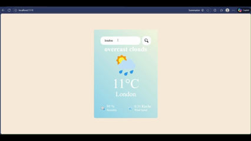

# React.JS Weather Application React.js + VITE

[](https://github.com/carlo022/React.JS-Weather-Application)
[](LICENSE)
[](https://openweathermap.org/api)
[](https://github.com/carlo022/React.JS-Weather-Application)
[](https://github.com/carlo022)

This repository contains a polished, production-ready React weather application built to demonstrate modern front-end engineering skills: clean component design, API integration, responsive UI, performance-conscious builds, accessibility considerations, and deployment readiness.

---

Contents
- Quick demo
- Key features
- Technical highlights & architecture
- Installation & quick start
- Contributing, License, Contact

---

Quick demo

- Web View:  
   
- Mobile View:  
  </img>
----
Key features

- Search weather by city or use geolocation
- Current conditions: temperature, feels-like, humidity, wind, description, icon
- Multi-day forecast (where available)
- Unit toggle: Celsius / Fahrenheit
- Robust error handling (invalid city, network errors)
- Loading skeletons and accessible labels
- Responsive layout for mobile & desktop
---

Technical highlights & architecture

- Stack: React (functional components + hooks), CSS (or CSS-in-JS), Fetch/axios, OpenWeather API
- Language composition: ~71% JavaScript, ~23% CSS, ~6% HTML
- Folder structure (simplified):
  
Design decisions
- Separation of concerns: services/weatherService.js encapsulates API contracts and retries.
- Small, focused components so each unit is easy to test and reuse.
- Debounced search input to reduce unnecessary API calls and respect rate limits.
- Accessibility: semantic HTML, aria-labels, and focus management for keyboard users.

---

Installation & quick start

Prerequisites
- Node.js v16+ and npm or yarn
- OpenWeather API key (free tier OK)

Setup
```bash
git clone https://github.com/carlo022/React.JS-Weather-Application.git
cd React.JS-Weather-Application
npm install
# or
yarn
```

Create .env (do not commit)
```
REACT_APP_OPENWEATHER_API_KEY=your_openweather_api_key_here
REACT_APP_BASE_URL=https://api.openweathermap.org/data/2.5
REACT_APP_UNITS=metric
```

Start development
```bash
npm start
# or
yarn start
```

Build for production
```bash
npm run build
# or
yarn build
```

---

Example code snippets (showcasing practical skills)

1) Fetching current weather with encapsulated service (readability + testability)
```js
// src/services/weatherService.js
const BASE = process.env.REACT_APP_BASE_URL;
const KEY = process.env.REACT_APP_OPENWEATHER_API_KEY;

export async function fetchCurrentWeather(city, units = 'metric') {
  const url = `${BASE}/weather?q=${encodeURIComponent(city)}&appid=${KEY}&units=${units}`;
  const res = await fetch(url);
  if (!res.ok) {
    const err = await res.json().catch(() => ({ message: res.statusText }));
    throw new Error(err.message || 'Failed to fetch weather');
  }
  return res.json();
}
```

2) Debounced search hook to limit API calls
```js
// src/hooks/useDebounce.js
import { useEffect, useState } from 'react';

export default function useDebounce(value, delay = 300) {
  const [debounced, setDebounced] = useState(value);
  useEffect(() => {
    const id = setTimeout(() => setDebounced(value), delay);
    return () => clearTimeout(id);
  }, [value, delay]);
  return debounced;
}
```

3) Sample React usage (compact and testable)
```jsx
// src/components/SearchBar.jsx
import React, { useState } from 'react';
import useDebounce from '../hooks/useDebounce';

export default function SearchBar({ onSearch }) {
  const [q, setQ] = useState('');
  const debouncedQ = useDebounce(q, 400);

  React.useEffect(() => {
    if (debouncedQ) onSearch(debouncedQ);
  }, [debouncedQ, onSearch]);

  return (
    <input
      aria-label="Search city"
      placeholder="Search city..."
      value={q}
      onChange={e => setQ(e.target.value)}
    />
  );
}
```
---

Contributing

This repo is primarily a portfolio piece. If you'd like to propose improvements:
1. Fork the repo
2. Create a descriptive branch: feat/describe-change
3. Open a PR with a clear description and screenshots/video if UI changes are included

See CONTRIBUTING.md for full guidelines (you can add one).

---

License

MIT — see LICENSE for details.

---

Contact / Hire me

Carlo — GitHub: @carlo022  
Email: (add email)  
LinkedIn: (add LinkedIn)

---

Acknowledgements & resources

- OpenWeather API — https://openweathermap.org/api
- React — https://reactjs.org/
- Performance & testing tools: Lighthouse, WebPageTest, Jest, React Testing Library

```
